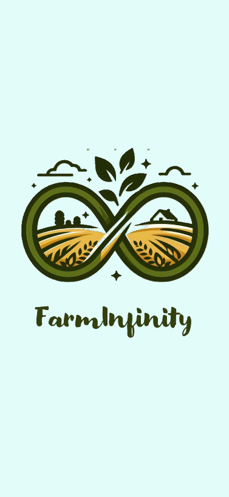

# FarmInfinity

Our solution is a comprehensive, multilingual platform designed to revolutionize price discovery in agricultural markets. It empowers farmers by providing real-time market information, price trends, and negotiation tools while fostering a collaborative social environment that connects all stakeholders—farmers, aggregators, processors, retailers, and volunteers.

## Figma Prototype

You can view the Figma prototype [here](https://www.figma.com/proto/O4kopATF64NZ2GOD0WV4KL/FarmInfinity?node-id=0-1&t=zDwOp4Et274izjgc-1).

## Sample Screenshots

## Demo Video 

You can view the Demo Video of the prototype  [here](https://drive.google.com/file/d/1MsDnd7GqGDshMqj6BEIDk-yqe2pf2lmy/view?usp=drive_link).

## Ideation PDF

You can checkout the Ideation PDF in the File Section.

### Developed By Jagdeesh P, Jhunandhini S and Praveena S
